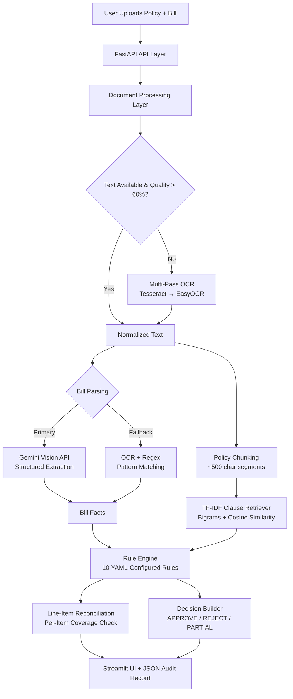

# Insurance Claim Settlement Agent — System Architecture

## 1. Purpose

An AI-powered system that evaluates medical insurance claims against policy documents and returns:

- A claim decision: `APPROVE`, `REJECT`, `PARTIAL`, or `INSUFFICIENT_DATA`
- A human-readable explanation with per-rule reasoning
- Policy citation details: page number and matched clause snippet
- Line-item reconciliation: per-item coverage status with policy references
- A full audit trail saved as JSON for traceability

## 2. Scope

### Current Implementation

1. Upload one insurance policy PDF.
2. Upload one hospital bill (PDF, PNG, JPG, JPEG, TIFF, BMP).
3. Extract text using PyMuPDF with multi-pass OCR fallback (Tesseract + EasyOCR).
4. Parse bill using **Google Gemini Vision API** (primary) or OCR + regex (fallback).
5. Chunk policy into searchable clauses with page metadata.
6. Retrieve the most relevant policy clauses using TF-IDF + cosine similarity.
7. Run **10 deterministic business rules** from YAML configuration.
8. Reconcile each bill line item against the policy.
9. Return a final decision with reasons, citations, and amounts.


## 3. Why This Architecture

The system uses a **modular monolith** architecture:

- Fast to build and iterate
- Easy to debug and present
- Clear separation of concerns across modules
- Each service is independently testable

## 4. Tech Stack

### Backend

- Python 3.11+
- FastAPI + Uvicorn

### UI

- Streamlit

### AI / ML

- **Google Gemini Vision API** (`gemini-2.5-flash`, `gemini-2.0-flash-lite`, `gemini-2.0-flash`) — primary bill parser with structured extraction
- **scikit-learn** TF-IDF vectorizer + cosine similarity — policy clause retrieval

### Document Processing

- **PyMuPDF** (`fitz`) — PDF text extraction with quality scoring
- **Tesseract OCR** via `pytesseract` — primary OCR backend with multi-pass preprocessing
- **EasyOCR** — pure-Python OCR fallback (no system binary required)
- **Pillow** — image preprocessing (sharpen, contrast, resize)

### Data and Config

- YAML for business rules configuration
- JSON for audit records and outputs
- Local filesystem storage
- Environment variables for secrets (`.env` file supported)

## 4.1 Cost and Licensing

| Component | Cost | License |
|-----------|------|---------|
| Python, FastAPI, Streamlit | Free | MIT / BSD |
| PyMuPDF, Pillow, scikit-learn | Free | AGPL / MIT / BSD |
| Tesseract OCR | Free | Apache 2.0 |
| EasyOCR | Free | Apache 2.0 |
| Google Gemini API | Free tier available | Google ToS |

The Gemini API key is loaded from the `GEMINI_API_KEY` environment variable. The system falls back to OCR + regex parsing if the API key is not set or quota is exceeded.

## 5. High-Level Components

### 5.1 User Interface (Streamlit)

- Upload policy PDF and hospital bill
- Submit claim for evaluation
- View extracted receipt details (patient, hospital, dates, diagnoses, procedures)
- View decision banner with amounts (total claimed, approved, rejected)
- Inspect rule-by-rule audit trail with expandable details
- View line-item reconciliation with per-item coverage status and policy citations
- OCR quality warnings for low/medium confidence

### 5.2 API Layer (FastAPI)

- `POST /claims/evaluate` — full pipeline orchestration
- `GET /claims/{audit_id}` — retrieve stored evaluation
- `GET /health` — health check
- Request validation via Pydantic schemas
- CORS middleware enabled

### 5.3 Document Processing Layer

- `extract_pdf.py` — page-wise text extraction with quality scoring
- `ocr_service.py` — multi-pass OCR with 4 preprocessing variants (sharpen, contrast+sharpen, high contrast, original)
- `normalize.py` — text cleaning, OCR artifact fixing, Indian number format handling

### 5.4 Bill Understanding Layer

**Primary: Gemini Vision API** (`gemini_parser.py`)
- Sends bill image/PDF directly to Gemini with a structured extraction prompt
- Returns all fields: patient name, hospital, dates, amounts, line items with categories
- Tries 3 models in fallback order with rate-limit retry
- Returns high OCR confidence

**Fallback: OCR + Regex** (`parse_bill.py`)
- 400+ lines of regex patterns for bill parsing
- Extracts: patient name (8 patterns), hospital name (brand detection), dates (multiple formats), amounts, room rent, procedures (20+ patterns), diagnoses (10+ patterns)
- Line-item extraction: tabular parsing + regex fallback
- OCR quality assessment: high/medium/low
- Gap filling for unreadable items

### 5.5 Policy Retrieval Layer

- `chunk_policy.py` — splits pages into ~500-char chunks at paragraph boundaries
- `retrieve_clause.py` — TF-IDF vectorizer with bigrams (max 5000 features), cosine similarity, minimum threshold of 0.01

### 5.6 Rule Engine (10 Rules)

Deterministic, YAML-configured rules evaluated against bill facts and retrieved clauses:

| # | Rule ID | Check | Impact |
|---|---------|-------|--------|
| 1 | `WAITING_PERIOD` | Claim within 30-day initial waiting period | Hard reject |
| 2 | `ROOM_RENT_CAP` | Room rent exceeds 1% of sum insured per day | Partial (proportionate deduction) |
| 3 | `EXCLUDED_PROCEDURE` | Cosmetic, dental, fertility, weight loss, ayurvedic, experimental | Hard reject |
| 4 | `PRE_EXISTING_DISEASE` | Diabetes, hypertension, asthma, thyroid, heart/kidney disease within 4-year window | Hard reject |
| 5 | `CO_PAY` | Co-payment percentage applicable (age-based) | Deduction |
| 6 | `SUM_INSURED_LIMIT` | Claimed amount exceeds sum insured | Partial or reject |
| 7 | `MIN_HOSPITALIZATION` | Less than 24 hours of hospitalization | Fail |
| 8 | `NON_MEDICAL_ITEMS` | Toiletries, telephone, TV, guest meals, etc. | Deduction |
| 9 | `DAYCARE_PROCEDURE` | Same-day admission/discharge detection | Info |
| 10 | `CLAIM_DOCUMENTATION` | Missing patient name, hospital, amount, or dates | Info |

### 5.7 Line-Item Reconciliation

- `reconcile.py` — per-item coverage decision
- Category-specific policy queries (room, surgery, medicine, diagnostic, consultation, ICU, nursing, anesthesia)
- Exclusion/sub-limit keyword detection in matched clauses
- Consistent with rule engine decisions (e.g., if ROOM_RENT_CAP failed, room items = sub_limited)

### 5.8 Decision Builder

- Aggregates rule results → final `APPROVE` / `REJECT` / `PARTIAL` / `INSUFFICIENT_DATA`
- Hard reject rules: `EXCLUDED_PROCEDURE`, `WAITING_PERIOD`
- Calculates deductions: room rent cap (proportionate), co-pay (percentage), sum insured (excess), non-medical (5% estimate)
- Generates audit ID: `CLM-YYYYMMDD-{6 hex chars}`
- Saves JSON audit record to `app/storage/outputs/`
- Adds OCR quality warnings to summary

### 5.9 Storage Layer

- `storage/uploads/` — uploaded policy and bill files
- `storage/outputs/` — JSON audit records per claim
- `storage/logs/` — application logs
- `storage/samples/` — generated test data

## 6. End-to-End Request Flow

1. User uploads a policy PDF and a hospital bill file.
2. API saves both files to the uploads directory.
3. Policy parser extracts text page by page using PyMuPDF.
4. If page text quality < 60%, multi-pass OCR is applied (4 preprocessing variants, best score wins).
5. **Gemini Vision API** parses the bill into structured JSON (patient, hospital, dates, amounts, line items).
6. If Gemini fails (no API key, quota exceeded, rate limited), falls back to OCR + regex parsing.
7. Text is cleaned and normalized (OCR artifacts fixed, Indian number formats handled).
8. Policy is chunked into ~500-char segments with page metadata.
9. TF-IDF index is built over policy chunks (bigrams, max 5000 features).
10. For each of the 10 business rules, the retriever finds the best matching policy clause.
11. Rule engine evaluates each rule using bill facts + retrieved citations.
12. Line-item reconciliation checks each bill item against policy for coverage status.
13. Decision builder aggregates rules → final verdict with amounts.
14. Audit record is saved as JSON.
15. UI displays decision, amounts, receipt details, rule audit trail, and line-item reconciliation.

## 7. Data Flow

### Inputs

- `policy.pdf`
- `bill.pdf` or `bill.png/jpg/jpeg/tiff/bmp`
- Optional metadata: policy start date, claim date, sum insured (default: ₹5,00,000)

### Intermediate Artifacts

- Extracted policy text by page (with quality scores)
- Extracted bill text (Gemini JSON or OCR text)
- Normalized text (OCR artifacts cleaned)
- Policy chunks with page metadata and headings
- Extracted bill facts (BillFacts schema)
- TF-IDF matrix over policy chunks
- Rule-to-clause retrieval mapping

### Outputs

- Final decision JSON (ClaimDecision schema)
- Per-rule results with citations
- Per-line-item reconciliation with coverage status
- Saved audit record (`CLM-YYYYMMDD-XXXXXX.json`)

## 8. API Design

### POST /claims/evaluate

Main endpoint for claim evaluation.

Request: multipart form data

| Field | Type | Required | Default |
|-------|------|----------|---------|
| policy_file | File (PDF) | Yes | — |
| bill_file | File (PDF/image) | Yes | — |
| policy_start_date | String (YYYY-MM-DD) | No | None |
| claim_date | String (YYYY-MM-DD) | No | None |
| sum_insured | Float | No | 500000.0 |

Response:

```json
{
  "audit_id": "CLM-20260404-A1B2C3",
  "decision": "PARTIAL",
  "summary_reason": "Partially approved. Issues found: Room Rent Cap Check.",
  "approved_amount": 64167,
  "rejected_amount": 12833,
  "total_claimed": 77000,
  "rules_fired": [
    {
      "rule_id": "ROOM_RENT_CAP",
      "name": "Room Rent Cap Check",
      "status": "fail",
      "reason": "Claimed room rent of 8000.0/day exceeds the allowed cap of 5000.0/day.",
      "citation": {
        "page": 6,
        "clause_text": "Room Rent (including boarding and nursing expenses) is limited to a maximum of 1% of the Sum Insured per day..."
      }
    }
  ]
}
```

### GET /claims/{audit_id}

Returns a stored evaluation result by audit ID.

### GET /health

Returns `{"status": "ok"}`.

## 9. Internal Modules

```text
app/
  main.py                  # FastAPI entry point + CORS + storage init
  schemas.py               # Pydantic models (ClaimDecision, BillFacts, etc.)
  api/
    routes_claims.py       # POST /evaluate, GET /{audit_id}
  services/
    gemini_parser.py       # Gemini Vision API bill parser (primary)
    extract_pdf.py         # PyMuPDF text extraction + OCR fallback
    ocr_service.py         # Multi-pass OCR (Tesseract + EasyOCR)
    normalize.py           # Text cleaning + OCR artifact fixing
    parse_bill.py          # Regex-based bill parser (fallback)
    chunk_policy.py        # Policy chunking with page metadata
    retrieve_clause.py     # TF-IDF clause retrieval
    rules_engine.py        # 10-rule evaluation engine
    reconcile.py           # Per-line-item policy reconciliation
    decision_builder.py    # Final decision + audit record
  config/
    rules.yaml             # Business rules configuration (10 rules)
  storage/
    uploads/               # Uploaded files
    outputs/               # JSON audit records
    logs/                  # Application logs
    samples/               # Generated test data
ui/
  streamlit_app.py         # Streamlit interactive UI
tests/
  test_rules_engine.py     # Unit tests for all 10 rules
  evaluate.py              # End-to-end evaluation (3 test cases)
  generate_samples.py      # Generate sample policy + 7 bill scenarios
```

## 10. Rule Engine Design

The rule engine is **deterministic and explainable**. Every decision can be traced back to a specific rule, input, and policy clause.

Each rule in `rules.yaml` contains:

- `rule_id` — unique identifier
- `name` — human-readable name
- `description` — what the rule checks
- `query_terms` — used for TF-IDF retrieval of relevant policy clauses
- `inputs_required` — which bill facts are needed
- `failure_message` / `success_message` — template strings with placeholders
- Rule-specific parameters (e.g., `default_waiting_days: 30`, `excluded_keywords: [...]`)

Implemented rules:

1. `WAITING_PERIOD` — 30-day initial waiting period check
2. `ROOM_RENT_CAP` — 1% of sum insured per day limit
3. `EXCLUDED_PROCEDURE` — exclusion list matching
4. `PRE_EXISTING_DISEASE` — 4-year exclusion window
5. `CO_PAY` — percentage-based deduction
6. `SUM_INSURED_LIMIT` — total amount vs sum insured
7. `MIN_HOSPITALIZATION` — 24-hour minimum stay
8. `NON_MEDICAL_ITEMS` — personal comfort item exclusion
9. `DAYCARE_PROCEDURE` — same-day procedure detection
10. `CLAIM_DOCUMENTATION` — completeness check

## 11. AI / ML Strategy

### Bill Parsing — Gemini Vision API (Primary)

The system uses Google Gemini as the primary bill parser:

- Sends the raw bill document (PDF or image) to Gemini Vision API
- Uses a detailed structured extraction prompt (~100 lines)
- Tries 3 models in fallback order: `gemini-2.5-flash` → `gemini-2.0-flash-lite` → `gemini-2.0-flash`
- Handles rate limits (HTTP 429) with 10-second retry
- Returns structured JSON parsed into `BillFacts` schema
- Falls back to OCR + regex if Gemini is unavailable

### Policy Clause Retrieval — TF-IDF + Cosine Similarity

- TF-IDF vectorizer with unigram + bigram features (max 5000)
- Cosine similarity for ranking policy chunks against rule queries
- Minimum similarity threshold of 0.01
- Returns top-k results with page metadata for citations

### OCR — Multi-Pass with Quality Scoring

- 4 preprocessing variants: sharpen, contrast+sharpen, high contrast, original grayscale
- Text quality scoring: length (30pts) + word validity (40pts) + domain signals (30pts)
- Best-scoring pass wins; early exit if score > 80

## 12. OCR Strategy

OCR is a fallback, not the default path:

1. PyMuPDF extracts embedded text from the PDF.
2. Quality score is calculated (word count, vowel ratio).
3. If quality < 60% or text < 50 chars, the page is rendered at 300 DPI.
4. Multi-pass OCR runs 4 preprocessing variants.
5. Best-scoring result is used.
6. OCR backend priority: Tesseract (if installed) → EasyOCR (pure-Python).

## 13. Explainability and Auditability

Every decision includes:

- **Per-rule audit trail**: rule name, status, reason, and the exact policy clause that was matched
- **Policy citations**: page number + clause snippet (truncated to 300 chars)
- **Line-item reconciliation**: each bill item mapped to covered/excluded/sub_limited/unknown with policy reference
- **OCR quality indicator**: warns when extracted data may be unreliable
- **Saved audit record**: full JSON written to `storage/outputs/{audit_id}.json`

## 14. Non-Functional Considerations

### Reliability

- Deterministic rules (same input = same output)
- Multi-level fallback: Gemini → Tesseract → EasyOCR → regex
- Graceful degradation for unreadable files (`INSUFFICIENT_DATA` decision)

### Performance

- CPU-only execution (no GPU required)
- Local file processing
- Gemini API calls are optional (system works fully offline with OCR)
- TF-IDF indexing is fast on small documents

### Security

- API keys loaded from environment variables (`.env` file)
- No hardcoded secrets in source code
- Input validation via Pydantic schemas
- File type validation before processing

### Maintainability

- Modular services with clear responsibilities
- YAML-configured rules (add new rules without code changes)
- Pydantic schemas enforce data contracts
- Comprehensive test suite (unit + end-to-end)

## 15. Test Strategy

### Unit Tests (`test_rules_engine.py`)

6 test functions covering all 10 rules:
- Approved clean claim (appendectomy)
- Excluded procedure (cosmetic)
- Room rent exceeded
- Waiting period violation
- Pre-existing disease within window
- Citation coverage for all rules

### End-to-End Evaluation (`evaluate.py`)

3 test cases: APPROVE, REJECT, PARTIAL
- Measures: decision accuracy, citation coverage, processing time

### Sample Data Generation (`generate_samples.py`)

7 bill scenarios covering all rule failure modes:
1. Approved clean (appendectomy, ₹65K)
2. Rejected exclusion (cosmetic rhinoplasty, ₹94K)
3. Partial room rent (pneumonia, ₹8K/day, ₹77K total)
4. Rejected waiting period (hernia within 30 days, ₹75.8K)
5. Rejected pre-existing (diabetic foot, ₹101K)
6. Partial co-pay (senior cardiac, 10% co-pay, ₹177.8K)
7. Partial sum insured (hemorrhage, ₹625K vs ₹500K cap)

## 16. Demo Scenarios

The system demonstrates three key outcomes:

1. **APPROVE** — valid claim, all 10 rules pass
2. **REJECT** — cosmetic procedure or waiting period violation
3. **PARTIAL** — room rent cap exceeded, co-pay deduction, or sum insured limit

## 17. Future Improvements

- Named Entity Recognition (NER) for better medical field extraction
- Semantic embeddings (sentence-transformers) instead of TF-IDF
- LLM-assisted explanation generation
- Database-backed audit history (PostgreSQL)
- Multi-policy comparison
- Human-in-the-loop review workflow
- Confidence scoring per rule
- Batch claim processing
- Webhook notifications for claim status

## 18. Architecture Diagram



## 19. Environment Configuration

The system uses environment variables for configuration. Create a `.env` file in the project root:

```env
GEMINI_API_KEY=your_google_gemini_api_key
TESSERACT_PATH=/usr/bin           # optional: path to Tesseract binary
```

If `GEMINI_API_KEY` is not set, the system operates in offline mode using OCR + regex for bill parsing.

## 20. Final Note

This architecture balances practical AI (Gemini Vision, TF-IDF retrieval, multi-pass OCR) with deterministic rule-based logic to produce transparent, auditable, and explainable claim decisions.